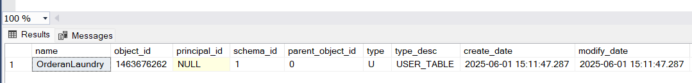

Pada catatan kali ini, kita akan mempelajari bagaimana menggunakan Rust untuk mengakses database Microsoft SQL Server. Berikut adalah tools yang digunakan:

- [Rust](https://www.rust-lang.org/)
- [Microsoft SQL Server](https://www.microsoft.com/en-us/sql-server)
- [Tokio](https://tokio.rs/)
- [Tiberius](https://docs.rs/tiberius/latest/tiberius/)

## Create a new project

Kita akan membuat project baru menggunakan `cargo new rust_sqlserver` untuk memulai. Lalu kita akan menambahkan `Cargo.toml` dan `main.rs` seperti berikut:

```bash
$ cargo new rust_sqlserver
$ cd rust_sqlserver
```
Kemudian buka dengan menggunakan code editor, disini saya menggunakan Visual Studio Code. Secara default, kita akan dibuatkan project baru seperti berikut:

```bash
.
├── Cargo.toml
├── .gitignore
├── src
│   └── main.rs
└── README.md
```

#### Isi file `main.rs`
```rust
fn main() {
    println!("Hello, world!");
}
```
#### Isi file `Cargo.toml`
```toml
[package]
name = "rust_sqlserver"
version = "0.1.0"
edition = "2021"

[dependencies]
```
---
## Preparation
Sebelum menggunakan Rust untuk mengakses database Microsoft SQL Server, kita perlu melakukan beberapa persiapan terlebih dahulu:

- Menginstal Tokio
- Menginstal Tiberius
- Mengubah `main.rs` menjadi `lib.rs` karena kita akan menjalankan program saja (tidak membuat aplikasi executable)

### Install Dependency

Tambahkan dependency seperti berikut pada file `Cargo.toml`:
```toml
tiberius = "0.12.3"
tokio = { version = "1.45.0",features = ["net", "macros", "rt-multi-thread"] }
tokio-util = {version = "0.7.15",features = ["compat"]}
```

### Change main.rs to lib.rs
```bash
mv main.rs lib.rs
```
Atau bisa langsung rename file `main.rs` menjadi `lib.rs` pada code editor.

---
## Run the program

Untuk menjalankan program, kita bisa menggunakan perintah `cargo test --exact nama_function --show-output` untuk menampilkan output dengan unit test. 

### Get Connection Host and Port
- Untuk terkoneksi ke database SQL Server jika login menggunakan Windows Authentication biasanya jalan di host `localhost` atau `127.0.0.1` dan port `1433`. Namun pada saat installasi bisa terjadi perubahan portnya.
- Kita perlu mencari lokasi host dan port dimana SQL Server berjalan dengan perintah berikut:

Jika menggunakan SQL Server Management Studio:
```bash
EXEC xp_readerrorlog 0, 1, N'Server is listening on';
```
Jika menggunakan Command Prompt:
```bash
sqlcmd -S localhost\SQLEXPRESS -E -Q "EXEC xp_readerrorlog 0, 1, N'Server is listening on';"
```
| LogDate | ProcessInfo | Text |
| -------- | -------- | -------- |
| 2025-05-18 08:14:45.670   | Server   | Server is listening on [ ::1 <ipv6> 1434] accept sockets 1.   |
| 2025-05-18 08:14:45.680   | Server   | Server is listening on [ 127.0.0.1 <ipv4> 1434] accept sockets 1. |

Di local komputer saya SQL Server berjalan di host `127.0.0.1` dan port `1434`.

---
## Let's Code it!
Setelah persiapan selesai, kita bisa menulis kode untuk terkoneksi ke database SQL Server seperti berikut:

### Connect ke SQL Server dengan Windows Authentication `host` and `post`
```rust
pub async fn connect_with_host_port() -> Result<(), Box<dyn std::error::Error>> {
    let mut config = Config::new();

    // Windows Authentication (SSPI)
    config.authentication(AuthMethod::Integrated);

    // Ganti ini sesuai alamat & port servermu
    config.host("127.0.0.1");
    config.port(1434); // atau port hasil dari konfigurasi
    config.trust_cert(); // opsional jika SSL tidak disertifikasi

    let tcp = TcpStream::connect(config.get_addr()).await?; // koneksi ke server
    let connection = Client::connect(config, tcp.compat_write()).await?; 
    println!("Connected with Windows Authentication!");
    connection.close().await?;

    Ok(())
}

// Test the function
#[tokio::test]
async fn connect_to_sql_server_using_host_port() {
    let result = connect_with_host_port().await;
    assert_eq!(result.is_ok(), true);
}
```
Setelah itu, kita bisa menjalankan program dengan perintah `cargo test --exact connect_to_sql_server_using_host_port --show-output` untuk menampilkan output.

Output:
```bash
$ cargo test --exact connect_to_sql_server_using_host_port --show-output
...
........

running 1 test
test connect_to_sql_server_using_host_port ... ok

successes:

---- connect_to_sql_server_using_host_port stdout ----
Connected with Windows Authentication!


successes:
    connect_to_sql_server_using_host_port

test result: ok. 1 passed; 0 failed; 0 ignored; 0 measured; 0 filtered out; finished in 0.04s

   Doc-tests rust_sqlserver

running 0 tests

successes:

successes:

test result: ok. 0 passed; 0 failed; 0 ignored; 0 measured; 0 filtered out; finished in 0.00s
```
Hasil output `test result: ok. 1 passed;` artinya kita berhasil terkoneksi ke database SQL Server menggunakan Windows Authentication.

---

---
## Agenda Pada Catatan Ini
- Connect SQL Server menggunakan Username dan Password.
- Connect SQL Server menggunakan Connection String.
- CRUD pada table.
- CRUD dengan stored procedure.
- CRUD dengan function.

### Connect ke SQL Server dengan SQL Server Authentication `host` and `post`
Sebelumnya kita telah terkoneksi ke database SQL Server menggunakan Windows Authentication. Sekarang kita akan mempelajari bagaimana menggunakan Username dan Password Authentication.

Tambahkan function connect_with_host_port_username_password di file `lib.rs`.

```rust
// Connect with SQL Server Authentication
pub async fn connect_with_host_port_username_password() -> Result<(), Box<dyn std::error::Error>> {
    let mut config = Config::new();

    // Use SQL Server Authentication (user name and password)
    config.authentication(AuthMethod::sql_server("sa", "Snakesystem"));

    config.host("127.0.0.1");
    config.port(1434);
    config.trust_cert();

    let tcp = TcpStream::connect(config.get_addr()).await?;
    let connection = Client::connect(config, tcp.compat_write()).await?;
    println!("Connected to SQL Server");
    let _ = connection.close().await?;

    Ok(())
}
```

Kemudian buat test function di bawahnya seperti ini di file `lib.rs`:

```rust
#[tokio::test]
async fn connect_to_sql_server_using_host_port_username_password() {
    let result = connect_with_host_port_username_password().await;
    assert_eq!(result.is_ok(), true);
}
```
Dan jalankan program dengan perintah `cargo t connect_to_sql_server_using_host_port_username_password`

Output:
```bash
$ cargo t connect_to_sql_server_using_host_port_username_password
...
running 1 test
test connect_to_sql_server_using_host_port_username_password ... ok

test result: ok. 1 passed; 0 failed; 0 ignored; 0 measured; 1 filtered out; finished in 0.04s
```

Hasil output `test result: ok. 1 passed;` artinya kita berhasil terkoneksi ke database SQL Server menggunakan Username dan Password.

---
### Connect ke SQL Server dengan Connection String
Pada tiberius, kita bisa menggunakan 2 jenis format connection string:

- [ADO.NET format Connection String](https://learn.microsoft.com/en-us/dotnet/framework/data/adonet/)
- [JDBC format Connection String](https://docs.oracle.com/javase/8/docs/technotes/guides/jdbc/)

#### ADO.NET format Connection String

ADO.NET format sendiri adalah sebuah connection string yang biasanya digunakan pada aplikasi .NET Framework atau .NET Core untuk terkoneksi ke database SQL Server. Contohnya seperti berikut:
```sql
Server=tcp:server_name atau host,port;IntegratedSecurity=true;TrustServerCertificate=true
```
Namun perlu digaris bawahi <u>Mengunakan Connection String dengan format ADO.NET pada tiberius di rust tidak memerlukan .NET di komputer.</u> Jadi kita bisa langsung menggunakannya.

Buat function baru di file `lib.rs` seperti berikut:

```rust
// Connect with ADO.NET
pub async fn connect_with_ado_host_port() -> Result<(), Box<dyn std::error::Error>> {
    
    // Menggunakan ADO.NET connection string
    let config = Config::from_ado_string(
        &"Server=tcp:127.0.0.1,1434;IntegratedSecurity=true;TrustServerCertificate=true",
    )?;

    let tcp = TcpStream::connect(config.get_addr()).await?;
    let _ = tcp.set_nodelay(true);

    let connection = Client::connect(config, tcp.compat_write()).await?;
    println!("Connected to SQL Server");
    let _ = connection.close().await;

    Ok(())
}

#[tokio::test]
async fn connect_to_sql_server_using_ado_host_port() {
    let result = connect_with_ado_host_port().await;
    assert_eq!(result.is_ok(), true);
}
```
Ouh iya bang, seperti sebelumnya disini SQL Server gue berjalan di host `127.0.0.1` dan port `1434`. Jadi kaya gini `Server=tcp:127.0.0.1,1434;`. Jadi sesuaikan sama host yang ada di komputer lu bang. Nah kalo udah selesai, jalankan program dengan perintah `cargo t connect_to_sql_server_using_ado_host_port`

Output:
```bash
$ cargo t connect_to_sql_server_using_ado_host_port
...
running 1 test
test connect_to_sql_server_using_ado_host_port ... ok

test result: ok. 1 passed; 0 failed; 0 ignored; 0 measured; 1 filtered out; finished in 0.04s
```

Misalnya kalo mau pake `Username` dan `Password` bisa pake format ADO.NET kaya gini bang:

```sql
Server=tcp:127.0.0.1,1434;User=sa;Password=Snakesystem;TrustServerCertificate=true
```
Jadi nanti dibagian code ini ditambahin user dan passwordnya bang:

```rust
// Menggunakan ADO.NET connection string
let config = Config::from_ado_string(
    &"Server=tcp:127.0.0.1,1434;User=sa;Password=Snakesystem;TrustServerCertificate=true",
)?;
```

#### JDBC format Connection String
JDBC ini kepanjangannya Java Database Connectivity. biasanya digunakan di aplikasi Java untuk terkoneksi ke database SQL Server. Nah sama kaya ADO.NET sebelumnya, JDBC juga tidak memerlukan Java atau JVM (Java Virtual Machine) di komputer. Jadi kita bisa langsung menggunakan JDBC.

Formatnya kurang lebih kaya gini bang:

```sql
jdbc:sqlserver://127.0.0.1:1434;integratedSecurity=true;trustServerCertificate=true
```

Ouh iya bang lupa, jadi format connection string kaya gini penjelasannya:
- `Server=tcp:`: refers/merujuk ke subprotocol. (ADO.NET format)
- `jdbc:sqlserver://`: refers/merujuk ke subprotocol. (JDBC format)
- `127.0.0.1`: host SQL Server.
- `1434`: port SQL Server.
- `integratedSecurity=true`: menggunakan Windows Authentication
- `trustServerCertificate=true`: menggunakan SSL

Oke lanjut, buat function baru di file `lib.rs` kaya gini:
```rust
// Connect with JDBC
pub async fn connect_with_jdbc_host_port() -> Result<(), Box<dyn std::error::Error>> {
    // pake JDBC format connection string
    let config = Config::from_jdbc_string(
        &"jdbc:sqlserver://127.0.0.1:1434;integratedSecurity=true;trustServerCertificate=true",
    )?;

    let tcp = TcpStream::connect(config.get_addr()).await?;
    let _ = tcp.set_nodelay(true);

    let connection = Client::connect(config, tcp.compat_write()).await?;
    println!("Connected to SQL Server");
    let _ = connection.close().await;

    Ok(())
}

#[tokio::test]
async fn connect_to_sql_server_using_jdbc_host_port() {
    let result = connect_with_jdbc_host_port().await;
    assert_eq!(result.is_ok(), true);
}
```

Jalankan program dengan perintah `cargo t connect_to_sql_server_using_jdbc_host_port`

Output:
```bash
$ cargo t connect_to_sql_server_using_jdbc_host_port
...
running 1 test
test connect_to_sql_server_using_jdbc_host_port ... ok

test result: ok. 1 passed; 0 failed; 0 ignored; 0 measured; 1 filtered out; finished in 0.04s
```

Pake SQL Server Authentication ? Bisa bang tinggal tambahin `user=username;password=password;` kaya gini misalnya:

```sql
jdbc:sqlserver://127.0.0.1:1434;user=sa;password=Snakesystem;trustServerCertificate=true
```

Oke untuk connection string kurang lebih kaya gitu bang. Untuk lebih lengkapnya semua format connection stringnya di SQL Server ada di [link ini](https://docs.microsoft.com/en-us/sql/connect/jdbc/building-the-connection-string?view=sql-server-ver15). Jadi bisa lu custom - custom bang connection stringnya.
---
## Refactoring
Lanjut...., eh sek... sebelum itu kita refactoring dulu projectnya biar lebih enak dilihat. Buat file baru di folder `src` namanya `connection.rs` kaya gini:

```bash
rust_sqlserver
├── Cargo.lock
├── Cargo.toml
├── .gitignore
├── src
│   └── lib.rs
│   └── connection.rs --> dibuat baru
└── README.md
```
Untuk function - function connection masukin ke file `connection.rs` kaya gini, jadi kaya gini:
```rust
// src/connection.rs

use tiberius::{AuthMethod, Client, Config};
use tokio::net::TcpStream;
use tokio_util::compat::TokioAsyncWriteCompatExt;

// Connect with Windows Authentication
pub async fn connect_with_host_port() -> Result<(), Box<dyn std::error::Error>> {
    // [...]
}

// Connect with SQL Server Authentication
pub async fn connect_with_host_port_username_password() -> Result<(), Box<dyn std::error::Error>> {
    // [...]
}

// Connect with ADO.NET
pub async fn connect_with_ado_host_port() -> Result<(), Box<dyn std::error::Error>> {
    // [...]
}

// Connect with JDBC
pub async fn connect_with_jdbc_host_port() -> Result<(), Box<dyn std::error::Error>> {
    // [...]
}
```
Di file `lib.rs` ganti jadi kaya gini bang:
```rust
// src/lib.rs

mod connection;

pub use connection::*;
```

Nah abis itu jalankan perintah `cargo build` di terminal lu bang. Kalo tidak ada error ayo lanjut.

---
### Query SQL untuk Table
Sekarang kita main - main sama Table di SQL server pake rust yuk bang. Pertama kita buat file baru dulu namanya `query.rs` kaya gini:
```bash
rust_sqlserver
├── Cargo.lock
├── Cargo.toml
├── .gitignore
├── src
│   └── connection.rs
│   └── lib.rs
│   └── query.rs --> dibuat baru
└── README.md
```
Jangan lupa panggil di file `lib.rs` kaya gini:
```rust
// [...] mod connection;
mod query;

// [...] pub use connection::*;
pub use query::*;
```

Download database [AdventureWorks2022](https://github.com/Microsoft/sql-server-samples/releases/download/adventureworks/AdventureWorks2022.bak) dan import dulu ke database SQL Server lu bang. Untuk versinya sesuaikan juga bang, kebetulah gue installnya SQL Server 2022, untuk database lainnya bisa lihat di [sini](https://learn.microsoft.com/en-us/sql/samples/adventureworks-install-configure?view=sql-server-ver17&tabs=ssms) bang.

Nah kalo udah di import, buat function baru di folder `src` namanya `query.rs` kaya gini:
```rust
// src/query.rs
use tiberius::{AuthMethod, Client, Config};
use tokio::net::TcpStream;
use tokio_util::compat::{Compat, TokioAsyncWriteCompatExt};

async fn connect_with_host_port() -> Result<Client<Compat<TcpStream>>, Box<dyn std::error::Error>> {
    let mut config = Config::new();
    config.authentication(AuthMethod::Integrated);
    config.host("127.0.0.1");
    config.port(1434);
    config.database("AdventureWorks");
    config.trust_cert();

    let tcp = TcpStream::connect(config.get_addr()).await?;
    let connection = Client::connect(config, tcp.compat_write()).await?;

    Ok(connection)
}
```
---
#### Create Table
Ouh iya `AdventureWorks` itu dari file `AdventureWorks2022.bak` bang. Selanjutnya kita buat function baru untuk **create table** di file `query.rs` kaya gini:
```rust
// src/query.rs

use tiberius::Query;

// Create Table
pub async fn create_table() -> Result<(), Box<dyn std::error::Error>> {
    let mut connection = connect_with_host_port().await?;

    let query_result = Query::new(
        r#"
        CREATE TABLE dbo.OrderanLaundry
        (
            LaundryOrderID INT IDENTITY CONSTRAINT PK_OrderanLaundry_LaundryOrderID PRIMARY KEY,
            RevisionNumber TINYINT CONSTRAINT DF_OrderanLaundry_RevisionNumber DEFAULT 0 NOT NULL,
            OrderDate DATETIME CONSTRAINT DF_OrderanLaundry_OrderDate DEFAULT getdate() NOT NULL,
            DueDate DATETIME NOT NULL,
            ShipDate DATETIME, 
            Status TINYINT CONSTRAINT DF_OrderanLaundry_Status 
                    DEFAULT 1 NOT NULL CONSTRAINT CK_OrderanLaundry_Status 
                    check ([Status] >= 0 AND [Status] <= 8),
            LaundryOrderNumber AS isnull(N'SO' + CONVERT([NVARCHAR](23), [LaundryOrderID]), N'*** ERROR ***'),
            CreditCardApprovalCode varchar(15),
            SubTotal MONEY CONSTRAINT DF_OrderanLaundry_SubTotal 
                    DEFAULT 0.00 NOT NULL CONSTRAINT CK_OrderanLaundry_SubTotal 
                    check ([SubTotal] >= 0.00),
            TaxAmt MONEY CONSTRAINT DF_OrderanLaundry_TaxAmt 
                    DEFAULT 0.00 NOT NULL CONSTRAINT CK_OrderanLaundry_TaxAmt 
                    check ([TaxAmt] >= 0.00),
            Freight MONEY CONSTRAINT DF_OrderanLaundry_Freight 
                    DEFAULT 0.00 NOT NULL CONSTRAINT CK_OrderanLaundry_Freight 
                    check ([Freight] >= 0.00),
            TotalDue AS isnull([SubTotal] + [TaxAmt] + [Freight], 0),
            Comment NVARCHAR(128),
            rowguid UNIQUEIDENTIFIER DEFAULT newid() NOT NULL,
            ModifiedDate DATETIME
        )
        "#,
    );

    let _ = query_result.execute(&mut connection).await?;
    println!("Created table");

    let _ = connection.close().await?;

    Ok(())
}
```

Jangan lupa panggil di file `lib.rs` untuk menjalankan function `create_table` kaya gini:
```rust
#[tokio::test]
async fn create_table_in_sql_server() {
    let result = create_table().await;
    assert_eq!(result.is_ok(), true);
}
```
Oke gas jalankan di terminal `cargo t create_table_in_sql_server` bang.
```bash
$ cargo t create_table_in_sql_server
Created table
test create_table_in_sql_server ... ok

test result: ok. 1 passed; 0 failed; 0 ignored; 0 measured; 0 filtered out; finished in 0.06s
```
Kalo berhasil, kemudian kita check table di SQL Server bang. btw gue pake SQL Server Management Studio (SSMS).
```sql
USE AdventureWorks
GO
SELECT * FROM sys.tables WHERE name = 'OrderanLaundry'
```
Output:

Nah sekarang gue punya table OrderanLaundry.

Sebagai programmer **`CRUD`** sejati😁, yakali ngga bikin (`*C*reate, *R*ead, *U*pdate dan *D*elete`)  